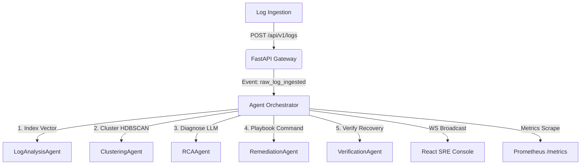

# RootLens: Self-Healing AI Log Analysis System

RootLens is a self-healing AI system designed to ingest large-scale application logs in real-time, group recurring issues via vector similarity clustering, run root-cause analysis (RCA) leveraging a Large Language Model (LLM), and trigger automated remediation actions to restore service health.

---

## 🚀 Key Features

* **Real-time Log Ingestion**: High-performance FastAPI endpoints built to accept and validate log streams using Pydantic.
* **Asynchronous Ingest Pipelines**: Immediately response to API log ingestion requests and offload heavy workloads to Celery and Redis.
* **Log Embedding Service**: Convert log messages into dense 384-dimensional semantic vectors using `sentence-transformers` (`BAAI/bge-small-en-v1.5`) with GPU/Apple Silicon acceleratio* **Vector Search Database**: Index and query logs and payloads with Qdrant vector database to perform semantic similarity matches.
* **Cooperative Multi-Agent Orchestrator**: Propagates events automatically across cooperative agents (`LogAnalysisAgent`, `ClusteringAgent`, `RCAAgent`, `RemediationAgent`, `VerificationAgent`).
* **AI Root Cause Analysis (RCA) & RAG**: Context-injected LLM diagnosis using historical resolutions fetched from Qdrant vector stores.
* **Safe Command Executor**: Allowlisted recovery command shell execution safely locked in sandboxed runs.
* **Verification Agent**: Post-remediation log auditing validation, closing the loop on service health.
* **WebSockets Sync**: Real-time event updates and notifications instantly pushed to connected SRE consoles.
* **Modern Web Dashboard**: Visual React + TS + Tailwind console displaying ingestion charts, log clusters, and incident remediation status.
* **System Observability**: Prometheus metrics export on `/metrics` and service checkups on `/health`.

---

## 🛠️ Architecture & Pipeline



---

## 📁 Repository Structure

```text
RootLens/
├── alembic/                # Database migrations history and environment
├── alembic.ini             # Alembic configuration
├── app/
│   ├── agents/
│   │   ├── base_agent.py   # Base abstract SRE Agent class
│   │   ├── orchestrator.py # Agent event propagator
│   │   └── sre_agents.py   # Ingestion, clustering, RCA, remediation, verification agents
│   ├── api/
│   │   ├── dashboard.py    # REST dashboard endpoints
│   │   └── logs.py         # Log API ingestion router
│   ├── services/
│   │   ├── clustering.py   # HDBSCAN clustering engine
│   │   ├── detection.py    # Log spike and error cluster incident engine
│   │   ├── embeddings.py   # Model loading and embedding vector service
│   │   ├── executor.py     # Safe shell-free allowlist command runner
│   │   ├── rag.py          # Qdrant knowledge base vector storage
│   │   ├── rca.py          # OpenAI root-cause analysis scribe
│   │   ├── remediation.py  # Remediation proposals state managers
│   │   ├── vector_store.py # Qdrant client, indexing, and semantic search
│   │   ├── verification.py # Post-remediation log checker
│   │   └── websocket.py    # Live WebSocket connection manager
│   ├── celery_app.py       # Celery worker application configuration
│   ├── config.py           # Configuration loading via pydantic-settings
│   ├── database.py         # SQLAlchemy engine and session setup
│   ├── main.py             # FastAPI bootstrapping entrypoint
│   ├── models.py           # SQLAlchemy schemas (Logs, Clusters, Incidents)
│   ├── schemas.py          # Pydantic validation schemas
│   └── tasks.py            # Celery tasks definitions (log processing)
├── frontend/               # React TypeScript Tailwind Recharts dashboard console
├── certs/                  # Nginx SSL cert keys directory
├── Dockerfile              # App and worker container building
├── docker-compose.yml      # Multi-service local production docker compose
├── nginx.conf              # Ingress routing proxy with WebSocket upgrades
├── prometheus.yml          # Prometheus metrics scrapers configs
├── requirements.txt        # Python project dependencies
├── test_ingestion.py       # Log API ingestion verification script
├── test_models.py          # Database relationship validation script
├── test_embeddings.py      # Embedding generation and similarity validation
├── test_qdrant.py          # Qdrant indexing and incident resolution validation
├── test_async.py           # Celery background processing integration test
└── test_system.py          # Comprehensive multi-agent integration verification test
```

---

## ⚙️ Installation & Setup

### 1. Prerequisites
Ensure you have **Python 3.9+**, **Node.js 18+**, and **Docker** installed.

### 2. Backend Environment Setup
```bash
# Create the virtual environment
python3 -m venv venv
source venv/bin/activate

# Upgrade pip and install dependencies
pip install --upgrade pip
pip install -r requirements.txt
```

### 3. Database Migrations
```bash
# Apply migrations to build the tables (logs, clusters, incidents)
alembic upgrade head
```

### 4. Frontend Environment Setup
```bash
cd frontend
npm install
```

---

## 🧪 Testing and Verification

Verify the system components using the test suites:

```bash
# 1. Model Relationships Test
python3 test_models.py

# 2. Embedding Service Test
python3 test_embeddings.py

# 3. Qdrant Integration Test
python3 test_qdrant.py

# 4. Background Async Pipeline Test
python3 test_async.py

# 5. Multi-Agent Integration Test (Verification, WebSockets, Metrics, Health)
python3 -m pytest test_system.py
```

---

## 🚀 Running the Project

You can run the entire RootLens system (Backend, Frontend, and Infrastructure) locally.

### Option A: Running via Docker Compose (Recommended)
This runs the entire stack (Postgres, Redis, Qdrant, Web Gateway, Worker, Prometheus, and Nginx reverse proxy):
```bash
# Start all containers in the background
docker-compose up -d --build
```
Access the system at:
- Nginx Gateway (SSL): `https://localhost` (Routes requests to dashboard and API)
- Prometheus Scraper: `http://localhost:9090`
- Qdrant Dashboard: `http://localhost:6333/dashboard`

### Option B: Running Locally for Development
1. **Start the Backend FastAPI Web Server**:
   ```bash
   source venv/bin/activate
   uvicorn app.main:app --host 0.0.0.0 --port 8000 --reload
   ```
2. **Start the Celery Background Worker**:
   ```bash
   source venv/bin/activate
   celery -A app.tasks.celery_app worker --loglevel=info
   ```
3. **Start the React Dashboard Frontend**:
   ```bash
   cd frontend
   npm run dev
   ```
   The dev server will spin up on `http://localhost:3000` and automatically proxy `/api` and `/ws` to the FastAPI backend.
